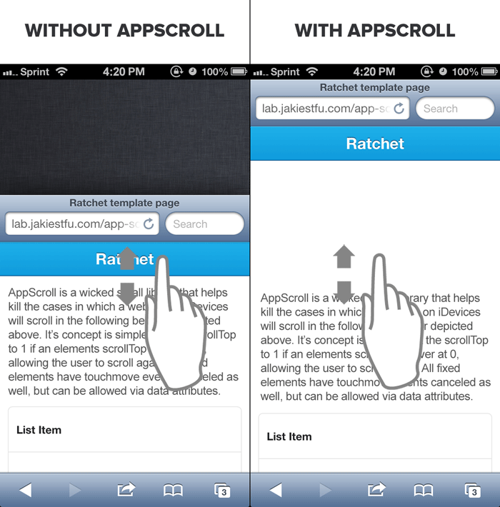

# AppScroll



AppScroll is a tiny JS library that fixes the "website dragging" issue caused on iDevices

## Usage

```javascript
var scroller = new AppScroll({
	toolbar: toolbarElement,
	scroller: contentElement
});
```

## Public Methods

### `on`: Turns on the events
```javascript
scroller.on();
```

### `off`: Turns off the events
```javascript
scroller.off();
```

## Compliments

This code attempts to make your webapp's feel more "native". These other repos go well with it, too!

* [Snap.js](https://github.com/jakiestfu/Snap.js)
* [AppScroll.js](https://github.com/jakiestfu/AppScroll)
* [fastclick](https://github.com/ftlabs/fastclick)

## License

MIT, Copyright 2013 Jacob Kelley
